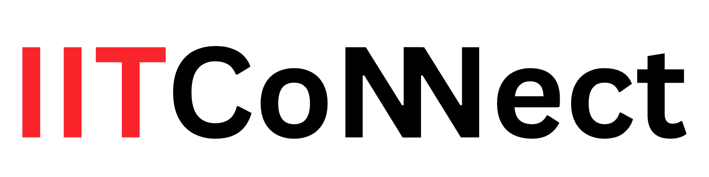

<div align="center" style="background-color:#ff1612; padding: 20px; border-radius: 10px;">
  
</div>

<div align="center">


&nbsp;
   
**A mobile social platform for university students and staff to connect, share events, and chat.**

[](https://nodejs.org/)
[](https://expo.dev/)
[](https://developer.mozilla.org/en-US/docs/Web/JavaScript)
[](https://www.mongodb.com/atlas)
[](https://expressjs.com/)
[](LICENSE)

[Features](#-features) · [Tech Stack](#-tech-stack) · [Getting Started](#-getting-started) · [Project Structure](#-project-structure) · [API Reference](#-api-reference) · [Contributors](--contributors)

</div>

---

## 📖 Overview

**IIT Connect** is a full-stack mobile application built as a social hub for university communities — specifically designed for students and staff at IIT. The platform brings together communication, event sharing, and real-time chat in a single, unified experience accessible from any mobile device.

The project follows a **monorepo architecture**, with a dedicated Node.js/Express REST API backend and a cross-platform React Native (Expo) mobile frontend.

---

## ✨ Features

| Feature | Status | Description |
|---|---|---|
| 🔐 Authentication | ✅ Live | Secure user registration and login |
| 👤 User Profiles | ✅ Live | Student & staff profile management |
| 📢 Event Sharing | ✅ Live | Post and discover campus events |
| 💬 Real-time Chat | ✅ Live | Messaging between students and staff |
| 🔔 Notifications | 🗓️ Coming soon | Activity alerts and event reminders |

---

## 🛠 Tech Stack

### Backend
| Technology | Purpose |
|---|---|
| [Node.js](https://nodejs.org/) (v18+) | Runtime environment |
| [Express.js](https://expressjs.com/) | REST API framework |
| [MongoDB](https://www.mongodb.com/) | NoSQL database |
| [Mongoose](https://mongoosejs.com/) | ODM for MongoDB |

### Mobile Frontend
| Technology | Purpose |
|---|---|
| [React Native](https://reactnative.dev/) | Cross-platform mobile framework |
| [Expo](https://expo.dev/) | Development tooling & build pipeline |
| [TypeScript](https://www.typescriptlang.org/) | Type-safe JavaScript |

---

## 📁 Project Structure
 
```
IIT-Connect/                              # Monorepo root
├── package.json
│
├── backend/                              # Node.js + Express REST API
│   ├── config/
│   │   ├── cloudinary.js                 # Cloudinary SDK configuration
│   │   ├── db.js                         # MongoDB connection setup
│   │   └── logger.js                     # Logger configuration
│   ├── controllers/
│   │   ├── authController.js             # Register, login, OTP, password reset
│   │   ├── postController.js             # Post CRUD logic
│   │   ├── timetableController.js        # Timetable query and filter logic
│   │   └── userController.js             # User profile management
│   ├── data/
│   │   ├── alumni_records.json           # Seeded alumni source data
│   │   └── timetable.json                # Raw timetable source data
│   ├── jobs/
│   │   └── storyCleanup.js               # Cron job: auto-expire old stories
│   ├── middleware/
│   │   ├── authMiddleware.js             # JWT verification middleware
│   │   └── clerkAuth.js                  # Clerk session verification middleware
│   ├── models/
│   │   ├── announcement.js
│   │   ├── ContentReport.js
│   │   ├── Conversation.js
│   │   ├── event.js
│   │   ├── Kuppi.js
│   │   ├── Message.js
│   │   ├── Post.js
│   │   ├── Reel.js
│   │   ├── Report.js
│   │   ├── Resource.js
│   │   ├── Story.js
│   │   ├── timetableEntry.js
│   │   └── user.js
│   ├── routes/
│   │   ├── announcements.js
│   │   ├── auth.js
│   │   ├── contentReports.js
│   │   ├── conversation.js
│   │   ├── events.js
│   │   ├── kuppi.js
│   │   ├── message.js
│   │   ├── posts.js
│   │   ├── reports.js
│   │   ├── resources.js
│   │   ├── stories.js
│   │   ├── timetable.js
│   │   ├── upload.js
│   │   └── users.js
│   ├── scripts/
│   │   ├── parseTimetable.js             # Parse raw timetable JSON
│   │   ├── reformatJson.js               # Utility: reformat JSON structure
│   │   ├── seedTimetable.js              # Seed timetable into MongoDB
│   │   └── seedUsers.js                  # Seed test users into MongoDB
│   ├── socket/
│   │   └── socketHandler.js              # Socket.io event handlers (chat, presence)
│   ├── seedReports.js                    # Seed sample report data
│   ├── timetable.json                    # Local timetable snapshot
│   ├── server.js                         # Application entry point
│   └── package.json
│
└── mobile-app/                           # React Native + Expo client
    ├── app/                              # Expo Router — file-based routes
    │   ├── _layout.jsx                   # Root layout (auth guard, providers)
    │   ├── index.jsx                     # Entry / splash redirect
    │   ├── oauth-native-callback.jsx     # Clerk OAuth callback handler
    │   ├── (tabs)/                       # Bottom tab navigator
    │   │   ├── _layout.jsx               # Tab bar configuration
    │   │   ├── index.jsx                 # Home feed (posts, reels, stories)
    │   │   ├── academic.jsx              # Academic hub (timetable, resources, Kuppi)
    │   │   ├── messages.jsx              # Conversations list
    │   │   ├── profile.jsx               # Current user's profile
    │   │   └── more.jsx                  # More / settings menu
    │   ├── messages/                     # Messaging sub-routes
    │   │   ├── _layout.jsx
    │   │   ├── chat.jsx                  # Individual chat screen
    │   │   ├── new-chat.jsx              # Start a new 1-on-1 chat
    │   │   ├── new-group.jsx             # New group chat flow
    │   │   ├── create-group.jsx          # Group setup and confirmation
    │   │   └── new-community.jsx         # Create a community conversation
    │   ├── create-post.jsx
    │   ├── create-reel.jsx
    │   ├── create-event.jsx
    │   ├── create-announcement.jsx
    │   ├── create-menu.jsx               # Content creation type selector
    │   ├── edit-profile.jsx
    │   ├── events.jsx
    │   ├── timetable.jsx
    │   ├── anonymous-report.jsx
    │   ├── my-reports.jsx
    │   ├── my-report-detail.jsx
    │   ├── report-detail.jsx
    │   └── admin-dashboard.jsx
    ├── assets/
    │   ├── data/
    │   │   └── timetable.json            # Bundled timetable data
    │   └── images/                       # App icons, splash, illustrations
    ├── src/
    │   ├── assets/images/
    │   │   └── iit-connect-logo.png
    │   ├── components/                   # Reusable UI components
    │   │   ├── AcademicNavBar.jsx
    │   │   ├── AttachmentPicker.jsx
    │   │   ├── ClassCard.jsx
    │   │   ├── CommentsBottomSheet.jsx
    │   │   ├── ContentReportCard.jsx
    │   │   ├── ContentSwitcher.jsx
    │   │   ├── CustomAlert.jsx
    │   │   ├── MediaMessage.jsx
    │   │   ├── MediaPreview.jsx
    │   │   ├── ModalDropdown.js
    │   │   ├── PillToggle.jsx
    │   │   ├── PostCard.jsx
    │   │   ├── ReelCard.jsx
    │   │   ├── ReelsFeed.jsx
    │   │   ├── ReportCard.jsx
    │   │   ├── StoriesRail.jsx
    │   │   └── TodayClassCard.jsx
    │   ├── config/
    │   │   └── api.js                    # Axios instance and base URL config
    │   ├── context/
    │   │   └── AuthContext.jsx           # Global auth state provider
    │   ├── hooks/
    │   │   └── useWarmUpBrowser.js       # Warm-up browser for Clerk OAuth
    │   ├── screens/                      # Full screens (non-routed)
    │   │   ├── LoginScreen.js
    │   │   ├── CreateAccountScreen.js
    │   │   ├── RoleSelectionScreen.js
    │   │   ├── EmailVerificationScreen.js
    │   │   ├── ForgotPasswordScreen.js
    │   │   ├── PasswordResetOTPScreen.js
    │   │   ├── NewPasswordScreen.js
    │   │   ├── SignupSuccessScreen.js
    │   │   ├── SplashScreen.js
    │   │   ├── WelcomeScreen.js
    │   │   ├── StudentIdDetailsScreen.js
    │   │   ├── UserDetailsScreen.js
    │   │   ├── AlumniAccountScreen.js
    │   │   ├── AlumniDetailsScreen.js
    │   │   ├── KuppiScreen.jsx
    │   │   ├── ResourcesScreen.jsx
    │   │   ├── TimetableScreen.jsx
    │   │   ├── AdminDashboardScreen.jsx
    │   │   ├── ReportDetailScreen.jsx
    │   │   └── profiles/
    │   │       ├── StudentProfile.jsx
    │   │       ├── LecturerProfile.jsx
    │   │       ├── AlumniProfile.jsx
    │   │       ├── EditStudentProfile.jsx
    │   │       ├── EditLecturerProfile.jsx
    │   │       └── EditAlumniProfile.jsx
    │   ├── services/
    │   │   ├── api.js                    # API service layer (request helpers)
    │   │   ├── mediaService.js           # Media pick and Cloudinary upload
    │   │   └── socketService.js          # Socket.io client connection manager
    │   └── utils/
    │       ├── clerkHelpers.js           # Clerk token and session utilities
    │       └── getAuthToken.js           # Retrieve stored auth token
    ├── app.json                          # Expo app configuration
    ├── eas.json                          # EAS Build profiles
    ├── eslint.config.js
    └── package.json
```

---

## 🚀 Getting Started

### Prerequisites

Make sure the following are installed on your machine before proceeding:

- **[Node.js](https://nodejs.org/)** v18 or higher
- **[Git](https://git-scm.com/)**
- **[Expo Go](https://expo.dev/client)** — install on your physical device:
  - [Android (Google Play)](https://play.google.com/store/apps/details?id=host.exp.exponent)
  - [iOS (App Store)](https://apps.apple.com/app/expo-go/id982107779)
- **MongoDB** — either a free [MongoDB Atlas](https://www.mongodb.com/atlas) cluster or a local MongoDB instance

---

### 1. Clone the Repository

```bash
git clone https://github.com/Dev-Liss/IIT-Connect.git
cd IIT-Connect
```

---

### 2. Configure & Run the Backend

```bash
# Move into the backend directory
cd backend

# Install dependencies
npm install

# Create your local environment file from the template
cp .env.example .env
```

Open `.env` and fill in the required values:

```env
MONGO_URI=mongodb+srv://<username>:<password>@cluster.mongodb.net/iit-connect
PORT=5000
JWT_SECRET=your_jwt_secret_here
```

> **⚠️ Never commit your `.env` file.** It is already listed in `.gitignore`.

```bash
# Start the development server
npm run dev
```

If configured correctly, you should see:

```
✅ MongoDB Connected: cluster.mongodb.net
✅ Server running on http://0.0.0.0:5000
```

---

### 3. Configure & Run the Mobile App

Open a **new terminal** from the project root:

```bash
# Move into the mobile app directory
cd mobile-app

# Install dependencies
npm install
```

**Set your local IP address:**

1. Find your machine's local IPv4 address:
   - **Windows:** Run `ipconfig` in Command Prompt → look for "IPv4 Address"
   - **macOS/Linux:** Run `ifconfig` or `ip addr`

2. Open `mobile-app/src/config/api.ts` and update the IP:

```ts
const LAPTOP_IP = "192.168.x.x"; // ← Replace with your actual IP
export const API_BASE_URL = `http://${LAPTOP_IP}:5000`;
```

```bash
# Start the Expo development server
npx expo start
```

---

### 4. Run on Your Device

1. Ensure your phone and development machine are on the **same Wi-Fi network**.
2. Open the **Expo Go** app on your phone.
3. Scan the QR code shown in your terminal or browser.

The app will load directly on your device.

---

## 🔌 API Reference

**Base URL:** `http://<your-ip>:5000`

### Authentication

| Method | Endpoint | Description | Auth Required |
|---|---|---|---|
| `POST` | `/api/auth/register` | Register a new user | No |
| `POST` | `/api/auth/login` | Login and receive a token | No |

#### `POST /api/auth/register`

**Request Body:**
```json
{
  "name": "Jane Doe",
  "email": "jane@iit.edu",
  "password": "securepassword123"
}
```

**Success Response `201`:**
```json
{
  "message": "User registered successfully",
  "token": "<jwt_token>"
}
```

#### `POST /api/auth/login`

**Request Body:**
```json
{
  "email": "jane@iit.edu",
  "password": "securepassword123"
}
```

**Success Response `200`:**
```json
{
  "token": "<jwt_token>",
  "user": {
    "id": "64f...",
    "name": "Jane Doe",
    "email": "jane@iit.edu"
  }
}
```

---

## 🧩 Environment Variables

### Backend (`backend/.env`)

| Variable | Required | Description | Example |
|---|---|---|---|
| `MONGO_URI` | ✅ | MongoDB connection string | `mongodb+srv://...` |
| `PORT` | ✅ | Port the server listens on | `5000` |
| `JWT_SECRET` | ✅ | Secret key for signing JWTs | `supersecretkey123` |

> Copy `backend/.env.example` as a starting template.

---

## 🐛 Troubleshooting

| Problem | Likely Cause | Solution |
|---|---|---|
| `Cannot connect to server` | Wrong IP or different Wi-Fi | Verify `api.ts` IP matches your current network |
| `MONGO_URI undefined` | Missing `.env` file | Run `cp .env.example .env` and fill in values |
| `User not found` | Logging in before registering | Register an account first |
| `Port already in use` | Another process on port 5000 | Run `npx kill-port 5000` |
| `Network request failed` | Backend not running | Ensure `npm run dev` is active in `/backend` |
| `Expo QR not working` | Phone on different network | Connect phone and laptop to the same Wi-Fi |

---

### Commit Message Convention

This project follows [Conventional Commits](https://www.conventionalcommits.org/):

| Prefix | When to Use |
|---|---|
| `feat:` | New feature |
| `fix:` | Bug fix |
| `docs:` | Documentation updates |
| `style:` | Code formatting (no logic changes) |
| `refactor:` | Code restructuring without new features |
| `chore:` | Build config, dependency updates |

### Code of Conduct

- **Never commit `.env` files** — they contain secrets.
- **Always pull before pushing** to avoid merge conflicts.
- **Write meaningful commit messages** — future teammates will thank you.
- **Review your own PR** before requesting a review from others.

---

## 🗺️ Roadmap

- [x] User authentication (register & login)
- [ ] JWT-based session management (Phase 3)
- [ ] User profile screens
- [ ] Event creation & feed
- [ ] Real-time chat (WebSockets)
- [ ] Push notifications
- [ ] App Store / Play Store deployment

---

## 👨‍💻 Contributors

<table>
  <tr>
    <td align="center">
      <a href="https://github.com/Dev-Liss">
        <br />
        <sub><b>Lisara</b></sub>
      </a>
    </td>
    <td align="center">
      <a href="https://github.com/injaz89">
        <br />
        <sub><b>Injaz</b></sub>
      </a>
    </td>
    <td align="center">
      <a href="https://github.com/yzindu">
        <br />
        <sub><b>Yasindu</b></sub>
      </a>
    </td>
    <td align="center">
      <a href="https://github.com/Rimy14">
        <br />
        <sub><b>Rimaz</b></sub>
      </a>
    </td>
    <td align="center">
      <a href="https://github.com/HansanaWeerakkody">
        <br />
        <sub><b>Hansana</b></sub>
      </a>
    </td>
    <td align="center">
      <a href="https://github.com/ItsCreamy">
        <br />
        <sub><b>Chanul</b></sub>
      </a>
    </td>      
  </tr>
</table>

*A project of SDGP* <br>
*Built with ❤️ by Team Connect.*

---

## 📄 License

This project is licensed under the **MIT License**. See the [LICENSE](LICENSE) file for details.

---

<div align="center">
Made for the IIT community 🎓

</div>
